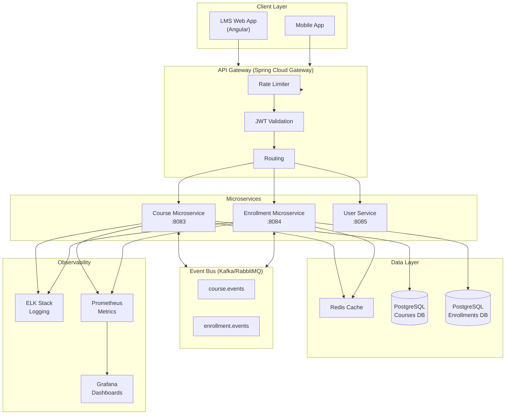
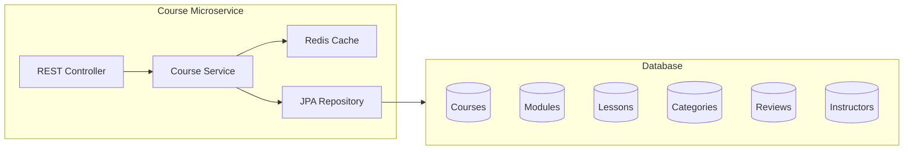
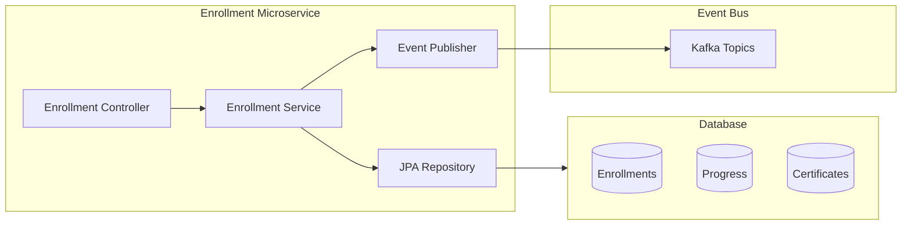

# ESM – English School Management System
## Enterprise Architecture Document

---

## 1. High-Level Architecture Diagram

---

## 2. Course Microservice – Data Flow

---

## 3. Enrollment Microservice – Data Flow

---

## 4. Technology Stack

| Component | Technology |
|-----------|------------|
| API Gateway | Spring Cloud Gateway |
| Course Service | Spring Boot 3.2, Spring Data JPA |
| Enrollment Service | Spring Boot 3.2, Spring Data JPA |
| Database | PostgreSQL (prod), H2 (dev) |
| Cache | Redis |
| Message Broker | Kafka (prod) / RabbitMQ (alt) |
| Auth | Spring Security + JWT |
| Docs | OpenAPI 3.0 / Swagger |
| Containerization | Docker, Kubernetes |
| CI/CD | GitHub Actions |
| Monitoring | Prometheus, Grafana |
| Logging | ELK (Elasticsearch, Logstash, Kibana) |
| Frontend | Angular 21 |

---

## 5. API Versioning

All APIs use path-based versioning: `/api/v1/...`
